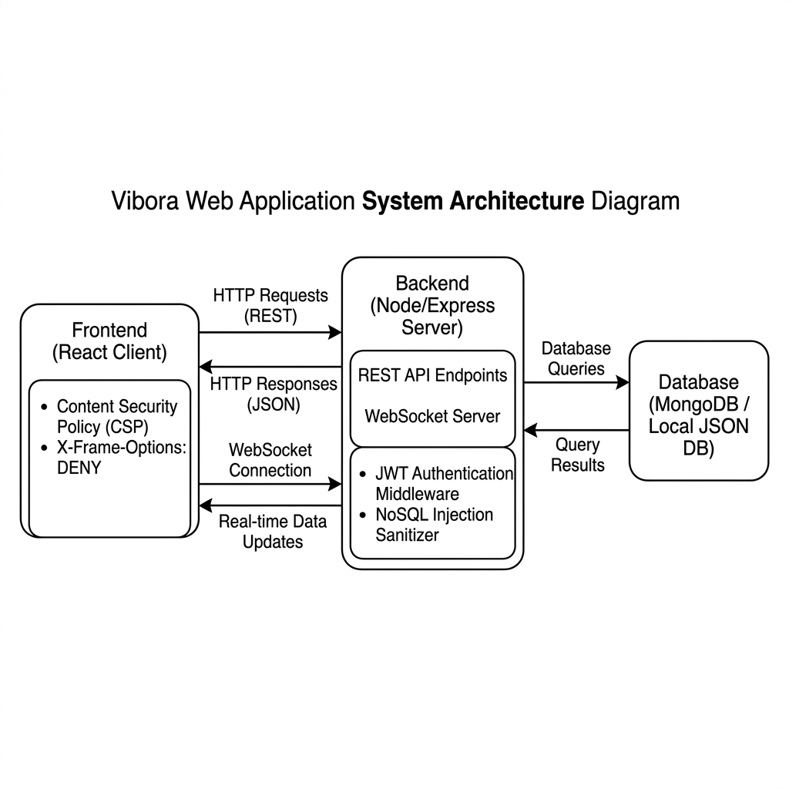

# United International University
## Department of CSE
### Project Proposal Report

**Course Name and Code:** Computer Security (CSE 4531)  
**Group No:** T15  

---

### Group Members
1. **Shariful Islam** — ID: `011221078`  
2. **Md. Mahmudul Hasan** — ID: `011221079`  
3. **Md. Ashiquzzaman Khan** — ID: `011221080`  
4. **Pulok Sikdar** — ID: `011221167`  
5. **Rahat Ahmed Shafi** — ID: `011221201`  
6. **Ahmad Hasan** — ID: `011221435`  

---

### Project Title
**Vibora: A Localized Community Portal and Social Network Tailored for Bangladesh**

---

### Motivation
Traditional centralized social networks utilize invasive tracking SDKs and telemetry scripts to harvest device specifications, interests, and location coordinates for commercial ad profiling. Meanwhile, federated alternatives face security issues, where node administrators can sniff unencrypted database tables directly. 

Vibora solves this by coupling coarse-grained campus and district discovery parameters with a secure, zero-latency server environment. It minimizes user profile exposure to specific university boundaries (e.g. UIU searches only returning UIU peers) and operates with zero external third-party tracking dependencies, ensuring citizen privacy and protection against global telemetry collection.

---

### Short Introduction about your project
Vibora is a localized community portal and social network designed specifically to solve local problems. It bridges the gap between social media connections and everyday utilities by combining features from Facebook groups, Reddit discussions, LinkedIn networking, and local classified boards (e.g. tuition matching, blood donor finding, job posting, notice board, and real-time chat).

From a security perspective, Vibora implements a robust mitigation layer:
* **Client Exploitation Defenses**: Integrates a strict `Content-Security-Policy (CSP)` script source lock and `X-Frame-Options: DENY` response headers to neutralize client-side hooking (BeEF framework) and clickjacking UI redressing (King Phisher mock overlays).
* **HTTP Security Headers**: Enforces `Strict-Transport-Security (HSTS)` and `X-Content-Type-Options: nosniff` to block MIME sniffing and MITM downgrade attacks.
* **NoSQL Database Injection Sanitizer**: Utilizes a recursive request parser in the backend entry point (`server.js`) that strips any keys starting with a dollar sign (`$`), completely blocking query operator bypasses on authentication endpoints.

---

### Diagram of your project
Below is the system architecture diagram outlining the communication between the React client, Node.js/Express application server, WebSocket real-time channel, and hybrid database adapter (MongoDB/Local JSON) along with the active security controls:

---

### Features of your project
1. **Secure Authentication & Session Controls**: Fully encrypted credential hashing using BCrypt salt rounds, stateless JWT authorization signatures for REST APIs, and JWT-authenticated WebSocket handshakes to secure real-time connections.
2. **Input Sanitization (NoSQL Injection Defense)**: Middleware filtering request bodies to recursively parse and strip potential query injections targeting NoSQL MongoDB schemas.
3. **HTTP Client-Side Exploitation Shields**: Global response headers enforcing strict CSP policies to block unauthorized script execution and `X-Frame-Options` to block iframe hijacking.
4. **Coarse-Grained Proximity Discovery**: Matches parent-tutor connections and blood donor seekers using coarse university and district parameters rather than tracking and leaking raw GPS telemetry.
5. **Real-Time WebSocket Messaging**: Chat channels powered by a native WebSocket manager implementing JWT signature validation for connection endpoints.
6. **In-Memory Database Shielding**: Prevents database connection exhaustion and API depletion attacks by utilizing RAM cache structures.
